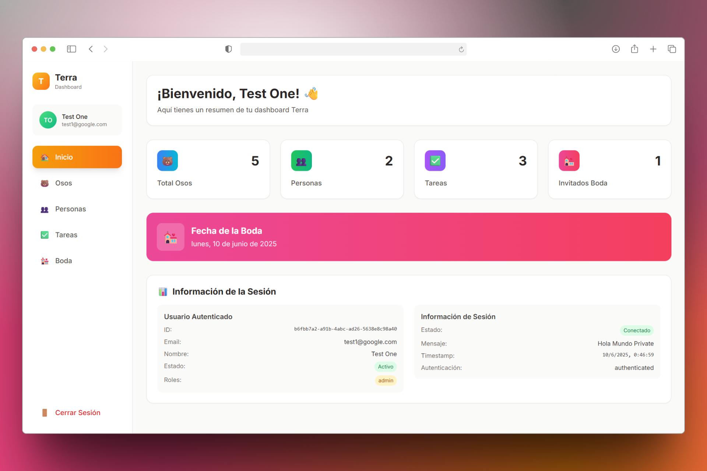

# Terra

[](./public/terra.png)

## Descripción General

**Terra** es una aplicación de ejemplo construida para aprender y dominar el manejo de estado global con [Zustand](https://zustand-demo.pmnd.rs/). Incluye autenticación, gestión de datos y persistencia avanzada, integrando buenas prácticas de React y TypeScript.

- **Login:** Formulario de acceso con credenciales de prueba visibles debajo del formulario. Al ingresar, se muestra un resumen del usuario y detalles de autenticación (estado, mensaje, timestamp, nombre, roles, estado activo, ID).
- **Objetivo:** El foco principal es el aprendizaje de Zustand, explorando stores, selectores, middlewares, slices, persistencia y suscripciones entre stores.

## Estructura de la Aplicación

- **Gestión de Osos:**
  - Aprendizaje de stores y selectores de Zustand.
  - Carpeta: `src/stores/bears/` y componentes en `src/components/bears/`.
- **Gestión de Personas:**
  - Separación de estado y acciones, uso de middlewares de persistencia (localStorage, sessionStorage, Firebase).
  - Carpeta: `src/stores/person/` y componentes en `src/components/people/`.
- **Gestión de Tareas:**
  - Mutación inmutable del estado usando el middleware de `immer` y drag & drop con React.
  - Carpeta: `src/stores/tasks/` y componentes en `src/components/tasks/`.
- **Planificación de Boda:**
  - Uso de slices de Zustand y persistencia de estados no primitivos.
  - Carpeta: `src/stores/wedding/` y componentes en `src/components/wedding/`.
- **Autenticación:**
  - Uso de Zustand fuera del contexto de React, suscripción entre stores.
  - Carpeta: `src/stores/auth/` y componentes en `src/components/auth/`.

## Estructura de Carpetas

- `src/pages/`: Páginas principales de la app (Home, Login, Bears, People, Tasks, Wedding).
- `src/components/`: Componentes reutilizables y específicos por dominio.
- `src/stores/`: Stores de Zustand organizados por dominio y middlewares personalizados.
- `src/interfaces/`: Tipos y contratos TypeScript para cada dominio.
- `src/services/`: Lógica de servicios y peticiones externas (ej: autenticación).
- `src/layouts/`: Layouts reutilizables para la estructura de las páginas.
- `src/hooks/`: Custom hooks para lógica reutilizable.
- `src/utils/`: Utilidades generales.
- `public/`: Recursos estáticos e imágenes.

## Demo en Producción

[https://terra-gbp.netlify.app/](https://terra-gbp.netlify.app/)

---

## Guía Rápida de Uso

### 1. Configuración del Entorno

Copia `.env.example` a `.env` y completa la variable:

```
VITE_FIREBASE_URL=<tu-url-firebase>
```

Las demás variables ya están configuradas por defecto.

### 2. Instalación de Dependencias

Este proyecto utiliza **Bun** como gestor de paquetes:

```sh
bun install
```

### 3. Levantar el Proyecto con Docker

La imagen utilizada es [`klerith/teslo-shop-cors`](https://hub.docker.com/r/klerith/teslo-shop-cors).

```sh
docker compose up -d
```

### 4. Iniciar el Servidor de Desarrollo

```sh
bun dev
```

### 5. Poblar la Base de Datos (SEED)

Visita:

```
http://localhost:3000/api/seed
```

### 6. Documentación de la API

```
http://localhost:3000/api
```

### 7. Credenciales de Prueba

```json
{
  "email": "test1@google.com",
  "password": "Abc123"
}
{
  "email": "test2@google.com",
  "password": "Abc123"
}
```

---

## Recursos y Guía de Zustand

- [Guía rápida de Zustand](./ZUSTAND_GUIDE.md)
- [Documentación oficial de Zustand](https://docs.pmnd.rs/zustand/getting-started/introduction)

---

## Autor y Licencia

Proyecto realizado por Eder Gustavo Benites Pardavé. Uso educativo. Licencia MIT.
